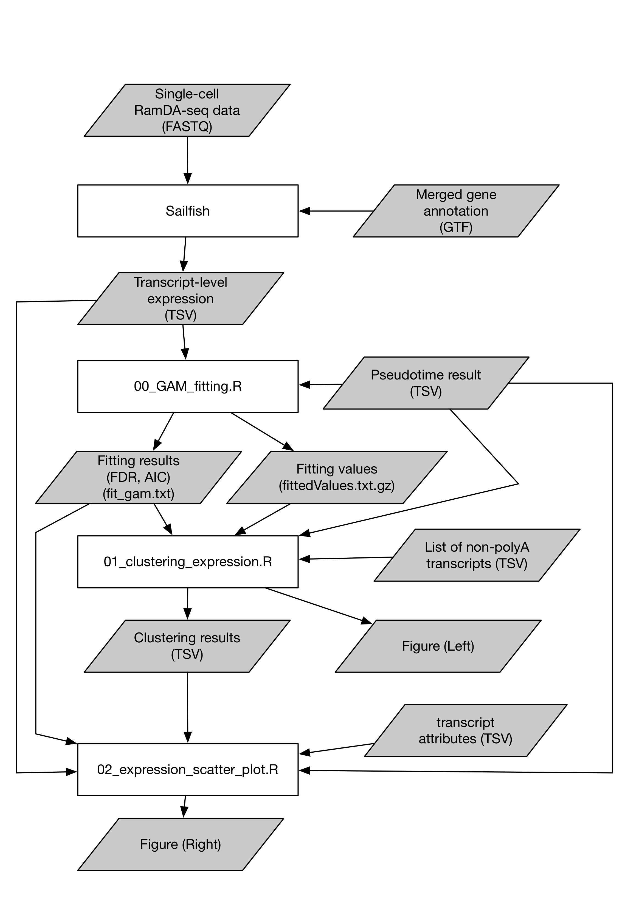

# How to draw figures in Hayashi et al., Nature Communications (2018)

Hayashi et al., Nature Communications (2018) https://doi.org/10.1038/s41467-018-02866-0

## Figure 3c




## Install and run
### Requirement
- R version 3.6.0
- git

### Required R packages

- ggplot2
- flashClust
- mgcv
- dplyr
- magrittr
- data.table
- dtplyr
- R.utils


### Test environment
- mac OS High Sierra (version 10.13.6), R version 3.6.0
- Linux, Docker `r-base:3.6.0`


### Run

Please execute the following command on shell:


```
$ git clone git@github.com:yuifu/tutorial-RamDA-paper-fugures.git
$ cd tutorial-RamDA-paper-fugures/Figure3c/
```

Check size of the large file to see if it have been properly downloaded:

```
$ du -sh data/transcript_expression_matrix.txt.gz
178M	data/transcript_expression_matrix.txt.gz
```

Run R:

```
$ R
```

Execute the following command on R to install required packages:

```
> install.packages(c(
+ 	"ggplot2",
+ 	"flashClust",
+ 	"mgcv",
+ 	"dplyr",
+ 	"magrittr",
+ 	"data.table",
+ 	"dtplyr",
+ 	"R.utils"
+ 	),
+ 	repos="https://cloud.r-project.org/"
+ )
```

Then, execute the following command on R:

```
> source("00_GAM_fitting.R")
> source("01_clustering_expression.R")
> source("02_expression_scatter_plot.R")
```


### Run using Docker

Please execute the following command on shell:

```
$ git clone git@github.com:yuifu/tutorial-RamDA-paper-fugures.git
$ cd tutorial-RamDA-paper-fugures/Figure3c/
```


Check size of the large file to see if it have been properly downloaded:

```
$ du -sh data/transcript_expression_matrix.txt.gz
178M	data/transcript_expression_matrix.txt.gz
```

Run R Docker image:

```
$ docker pull r-base:3.6.0
$ docker run -it --rm --name harukao_rbase_test \
-v $PWD:$PWD \
-w=$PWD \
r-base:3.6.0
```

Execute the following command on R to install required packages:

```
> install.packages(c(
+ 	"ggplot2",
+ 	"flashClust",
+ 	"mgcv",
+ 	"dplyr",
+ 	"magrittr",
+ 	"data.table",
+ 	"dtplyr",
+ 	"R.utils"
+ 	),
+ 	repos="https://cloud.r-project.org/"
+ )
```

Then, execute the following command on R:

```
> source("00_GAM_fitting.R")
> source("01_clustering_expression.R")
> source("02_expression_scatter_plot.R")
```

